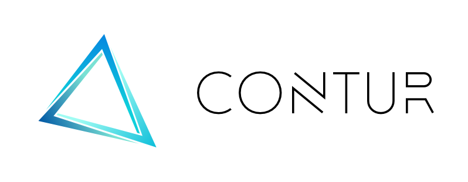

# Contur
Contur is an open-source command line application simplifying your local web development environment. It hosts your site using Docker containers so you don't have to install Apache, MySQL, PHP and PHP extensions on your own machine. Contur is written in Ruby and uses the Docker HTTP API.

[](https://travis-ci.org/Cheppers/contur)

## Requirements
* Ruby 2.3.0+ (recommended installation method [via rvm](https://rvm.io/rvm/install))
* Docker (for Mac see [this](https://docs.docker.com/engine/installation/mac/#/docker-for-mac))

## Installation
1. Install requirements (see above)
2. `gem install contur`

## Usage
1. Create a `.contur.yml` file in the root of your repository
2. Launch docker
3. Run `$ contur start` to build the image, launch the MySQL container and the Contur container
4. Run `$ contur restart` to restart the Contur container

When you run the `start` command the following will happen:

1. Contur builds a Docker image with apache, php-fpm and a couple of PHP extensions and configure them to work together
2. Contur downloads and starts a MySQL container (of your choice or the latest one if undefined in the YAML)
3. Contur starts the container
4. Contur runs the init script
5. You can access the site on `localhost:8088`
6. If your root directory is empty, Contur will create an index.php file with a phpinfo inside

When you run the `restart` command the following will happen:

1. Contur checks if your image is up-to-date and builds a new one if needed
2. Contur kills the currently running Contur container
3. Contur starts a new container and re-runs the init script

## The container
The following happens in the container when you start it:

1. Export the specified envrionment variables (`env` section)
2. Runs the commands from the `before` section
3. Starts apache
4. Starts php-fpm to keep alive the container

## The .contur.yml
The build file consists of sections: `version`, `use`, `before`, `env`.
The minimal YAML file for contur to work properly:
```yaml
---
version: 1.0
```

## Sections of the build file
### version - [required]
Version of the build file. Currently this is the only required section.

Allowed values: `1.0`

**Example**
```yaml
---
version: 1.0
```

### use - [optional]
Specify the MySQL and PHP versions you want to use.

#### PHP
Current default PHP version: **5.6.25**

At the moment specifying a PHP version is not working (to be implemented soon).

#### MySQL
Default is the latest from Dockerhub

To connect:

* no username
* password is 'admin'
* host address: $MYSQL_PORT_3306_TCP_ADDR

**Example**
```yaml
---
version: 1.0
use:
  mysql: 5.6.20
```

### env - [optional]
Specify environment variables to use them in the `before` script or in your site

**Example**
```yaml
---
version: 1.0
env:
  THE_ANSWER: 42
  DOCTOR: Who
```

### before - [optional]
Run scrips before starting php-fpm.

**Example**
```yaml
---
version: 1.0
before:
  - composer install
```

## Example .contur.yml
```yaml
---
version: 1.0
use:
  mysql: 5.6.20
env:
  YAML_DEFINED: envvar
  ANOTHER_ENV_VAR: Contur
before:
  - echo "Hello, $ANOTHER_ENV_VAR!<br />Generated at $(date)<br /> MySQL version $MYSQL_ENV_MYSQL_VERSION" > /www/index.php
```

## Commands
```bash
$ contur help
Commands:
  contur --version, -V          # Current version
  contur delete [-CIM]  # Delete container, image or MySQL container(s)
  contur help [COMMAND]         # Describe available commands or one specific command
  contur log                    # Get container log
  contur restart                # Restart contur container
  contur start                  # Build and start everything
  contur validate               # Validate build definition file

Options:
  -v, [--verbose], [--no-verbose]
  -f, [--force]
```

## Near-future goals and features to be implemented
- [ ] Selectable PHP version
- [ ] Configurable port mapping for MySQL and your site
- [ ] Multiple running environments
- [ ] Ability to choose between Apache and Nginx for server
- [ ] Ability to select/add PHP extensions

## Development
After checking out the repo, run `bin/setup` to install dependencies.

To install this gem onto your local machine, run `bundle exec rake install`. To release a new version, update the version number in `version.rb`, and then run `bundle exec rake release`, which will create a git tag for the version, push git commits and tags, and push the `.gem` file to [rubygems.org](https://rubygems.org).

## Contributing
1. Fork the repo
2. Commit your changes to your own repo on a separate branch
3. Submit pull request

If you can, please use the provided [EditorConfig](http://editorconfig.org/) file!

## Milestones
[List of Star Wars planets and moons](https://en.wikipedia.org/wiki/List_of_Star_Wars_planets_and_moons)

## License
The gem is available as open source under the terms of the [MIT License](https://opensource.org/licenses/MIT). See more in LICENSE.txt
